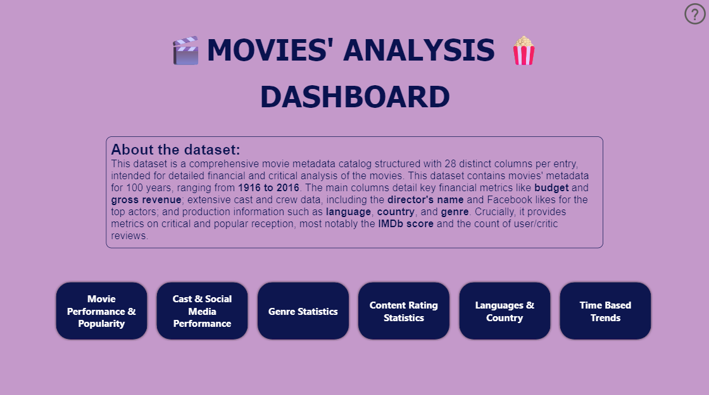
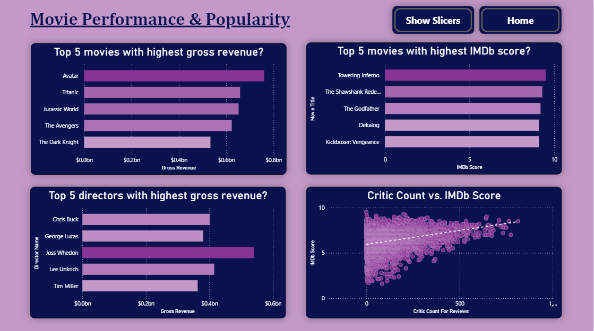
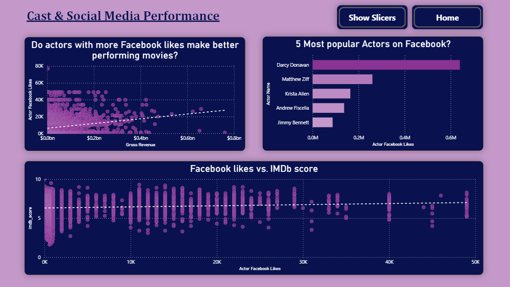
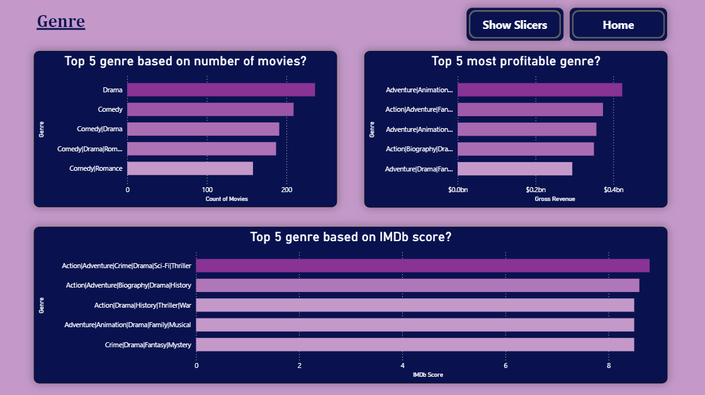
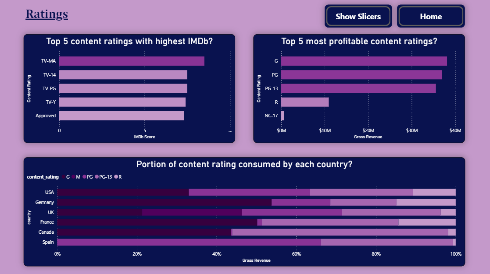
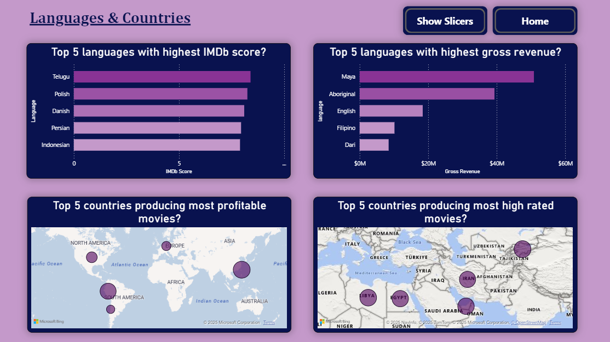
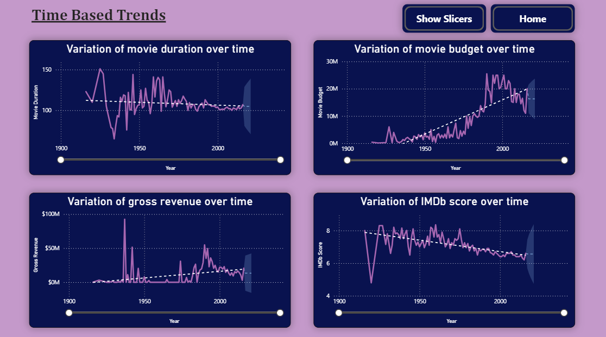

# 🎬 Movies' Analysis Dashboard (Power BI)

This project is a detailed **Power BI dashboard** built using an extensive movie metadata catalog (sourced from a public dataset containing IMDb, Box Office Mojo, and The Movie Database information).

The goal of this analysis is to uncover the hidden relationships, trends, and popular drivers of a movie's success, providing a comprehensive view of the industry landscape.

## 💾 Data Source and Metrics

The analysis is based on a large dataset of over 5,000 films, featuring **28 key attributes** including:

* **Financials:** `budget` and `gross` revenue.
* **Reception:** `imdb_score`, `num_voted_users`, and `num_critic_for_reviews`.
* **Talent Popularity:** `director_facebook_likes`, `actor_facebook_likes`, and `cast_total_facebook_likes`.
* **Metadata:** `genres`, `content_rating`, `title_year`, and `duration`.

---

## 📈 Dashboard Description

The dashboard is structured into six main pages, each focusing on a different aspect of movie performance. The user experience is enhanced with slicers and dynamic filters on all pages.

### **1. Movie Performance and Popularity**

This page is dedicated to analyzing the performance of the movies and their popularity among people, focusing on the top five best performing movies based on gorss revenue and IMDb score. It also display the top five directors based on the gross revenue and the relationship between the number of critics and the IMDb score.

**Findings:**
- For the timespan 1916 to 2016, the top 5 movies based on the gross revenue were: *Avatar (2009), Titanic (1997), Jurassic World (2015), The Avengers (2012)*, and *The Dark Knight (2008)*.

- For the timespan 1916 to 2016, the top 5 movies based on IMDb score were: *Towering Inferno (2011), The Shawshank Redemption (1994), The Godfather (1972), Dekalog (2008)*, and *Kickboxer: Vengeance (2016)*. 

- For the timespan 1916 to 2016, the top 5 directors producing movies with highest gross revenue were: *Chris Buck, George Lucas, Joss Whedon, Lee Unkrich*, and *Tim Miller*.

- There is a positive correlation between the number of critics for a movie and its IMDb score, meaning, the movies with more critic reviews tend to have higher IMDb ratings.

---

### **2. Cast and Social Media Performance**

This page is dedicated to analyzing the performance and popularity of the cast members over social media like *Facebook*. It focuses on the relationship between the popularity of the cast members and the performance of their movies based on the gross revenue and IMDb score. It also shows the top five most popular actors on Facebook.

**Findings:**
- The correlation coefficient between Facebook likes of actors and the gross revenue is positive, meaning, the movies featuring actors who are popular on social media platforms like Facebook, perform well in terms of gross revenue.

- For the timespan 1916 to 2016, the top 5 most popular actors on Facebook were: *Darcy Donovan, Matthew Ziff, Christa Allen, Andrew Fiscella*, and *Jimmy Bennett*.

- The correlation coefficient between Facebook likes of actors and the IMDb score is nearly 0, meaning, Facebook likes of actors have nearly no effect on the IMDb score of their movies.

---

### **3. Genre Statistics**

This page is dedicated to analyzing the movies based on their genre. It shows the top five genre based on the gross revenues and the IMDb score of the movies. It also visualizes top five genre based on the number of movies produced.

**Findings:**
- For the timespan 1916 to 2016, the most popular genre based on the number of movies produced were: *Drama, Comedy, Romance*, and their combinations.

- For the timespan 1916 to 2016, the most profitable genre based on gross revenue were: *Adventure, Animation, Drama, Family, Romance, Comedy, Fantasy*, and their combinations.

- For the timespan 1916 to 2016, the most profhigh rated genre based on IMDb score were: *Action Adventure, Animation, Crime, Drama, Sci-Fi, Thriller*, and their combinations.

---

### **4. Content Rating Statistics**

This page is dedicated to analyzing the movies based on their content ratings. It shows the top five content ratings based on the IMDb scores and gross revenues of the movies. It also visualizes the distribution of movies' content ratings for different countries.

**Findings:**
- For the timespan 1916 to 2016, the top 5 content ratings with highest IMDb score were: *TV-MA, TV-14, TV-PG, TV-Y*, and *Approved*.

- For the timespan 1916 to 2016, the top 5 content ratings with highest gross revenue were: *G, PG, PG-13, R*, and *NC-17*.

- For France and the USA, the movies with content rating of ***G*** earned the most of total gross revenue.

- For Spain, the movies with content rating of ***PG*** earned the most of total gross revenue.

---

### **5. Languages and Countries**

This page is dedicated to analyzing the movies based on metadata like languages and countries. It shows the top five languages based on the IMDb scores and gross revenues of the movies. It also visualizes the top five countries which produces most profitable and most high rated movies.

**Findings:**
- For the timespan 1916 to 2016, the top 5 languages which had the movies with highest IMDb score were: *Telugu, Polish, Danish, Persian*, and *Indonesian*.

- For the timespan 1916 to 2016, the top 5 languages which had the movies with highest gross revenue were: *Maya, Aborigional, English, Filipino*, and *Dari*.

- For the timespan 1916 to 2016, the top 5 countries which produced the movies with highest gross revenue were: *USA, Peru, Chile, Germany*, and *Taiwan*.

- For the timespan 1916 to 2016, the top 5 countries which produced the movies with highest IMDb score were: *Libya, Egypt, UAE, Iran*, and *Krygyzstan*.

---

### **6. Time Based Trends**

This page is dedicated to analyzing the variation metrics like movie duration, movie budget,gross revenue and IMDb score, over time.

**Findings:**
- Over the years, the variance in movie duration have reduced, with the movie duration settling around 100-120 minutes.

- Over the years, the movie budget has gone up significantly, especially after the year 1975. Although, it has seen a slight decline after the year 2000.

- Over the years, the median IMDb score of the movies have seen a steady decline.

---

## 🛠️ How to View and Interact

1.  **Download:** Clone this repository and download the `Movie Analysis.pbix` file.
2.  **Software:** You must have **Power BI Desktop** installed to open and interact with the file.
3.  **Interact:** All visuals are **cross-filtered**. Click on any data point to see how all other charts and metrics on that page update instantly. Use the slicer button on the top-right corner of each page to dynamically filter the data by year, country or language.